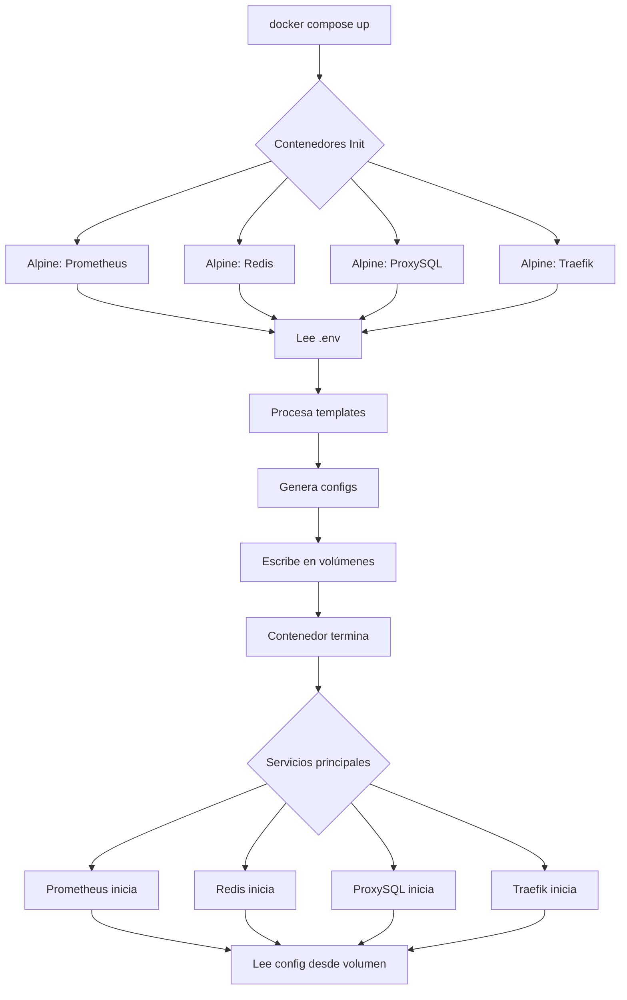

# Sistema de Inicialización de Configuraciones con Alpine

## Descripción General

Este sistema utiliza **contenedores Alpine Linux** eficientes y ligeros para generar archivos de configuración dinámicamente a partir de templates. Los archivos se generan al inicio usando variables de entorno desde el archivo `.env`.

## Arquitectura

```
┌─────────────────────────────────────────────────────────────┐
│                     Docker Compose                          │
└─────────────────────────────────────────────────────────────┘
                            │
        ┌───────────────────┼───────────────────┐
        │                   │                   │
        ▼                   ▼                   ▼
┌──────────────┐    ┌──────────────┐    ┌──────────────┐
│ Alpine Init  │    │ Alpine Init  │    │ Alpine Init  │
│ Prometheus   │    │    Redis     │    │  ProxySQL    │
└──────────────┘    └──────────────┘    └──────────────┘
        │                   │                   │
        ▼                   ▼                   ▼
┌──────────────┐    ┌──────────────┐    ┌──────────────┐
│   Volume     │    │   Volume     │    │   Volume     │
│ prometheus-  │    │   redis-     │    │  proxysql-   │
│   config     │    │   config     │    │   config     │
└──────────────┘    └──────────────┘    └──────────────┘
        │                   │                   │
        ▼                   ▼                   ▼
┌──────────────┐    ┌──────────────┐    ┌──────────────┐
│ Prometheus   │    │    Redis     │    │  ProxySQL    │
│  Container   │    │  Container   │    │  Container   │
└──────────────┘    └──────────────┘    └──────────────┘
```

## Componentes

### 1. Templates de Configuración
Ubicación: `scripts/config-templates/`

Cada servicio tiene su template con placeholders que serán reemplazados:

```
scripts/config-templates/
├── prometheus/
│   └── prometheus.yml.template
├── redis/
│   └── redis.conf.template
├── proxysql/
│   └── proxysql.cnf.template
└── traefik/
    └── traefik.yml.template
```

### 2. Scripts de Inicialización
Ubicación: `scripts/`

Scripts que ejecutan sed para reemplazar placeholders:

- `init-prometheus.sh` - Genera configuración de Prometheus
- `init-redis.sh` - Genera configuración de Redis con autenticación
- `init-proxysql.sh` - Genera configuración de ProxySQL con routing
- `init-traefik.sh` - Genera configuración de Traefik

### 3. Contenedores Alpine

Cada contenedor de inicialización:
- Es **ligero** (Alpine < 10MB)
- Se ejecuta **una sola vez** al inicio
- Lee variables del `.env`
- Genera archivos en volúmenes compartidos
- **Termina automáticamente** después de generar configs

## Variables de Entorno

### Prometheus
```bash
PROMETHEUS_SCRAPE_INTERVAL=15s
PROMETHEUS_EVALUATION_INTERVAL=15s
```

### Redis
```bash
REDIS_PASSWORD=redis_2025
REDIS_MAX_MEMORY=256mb
REDIS_DATABASES=16
```

### ProxySQL
```bash
PROXYSQL_ADMIN_USER=admin
PROXYSQL_ADMIN_PASSWORD=admin
MYSQL_MASTER_HOST=db-master
MYSQL_SLAVE_HOST=db-slave
MYSQL_MONITOR_USER=monitor_user
MYSQL_MONITOR_PASSWORD=monitor_password
```

### Traefik
```bash
TRAEFIK_API_INSECURE=true
TRAEFIK_DASHBOARD_ENABLED=true
TRAEFIK_LOG_LEVEL=INFO
```

## Uso

### Script de Gestión

Se proporciona un script de gestión ubicado en `scripts/manage-configs.sh`:

```bash
# Inicializar todas las configuraciones
./scripts/manage-configs.sh init-all

# Inicializar servicio específico
./scripts/manage-configs.sh init-prometheus
./scripts/manage-configs.sh init-redis
./scripts/manage-configs.sh init-proxysql
./scripts/manage-configs.sh init-traefik

# Ver estado de los contenedores de inicialización
./scripts/manage-configs.sh status

# Ver logs
./scripts/manage-configs.sh logs
./scripts/manage-configs.sh logs prometheus

# Limpiar volúmenes de configuración
./scripts/manage-configs.sh clean
```

### Inicio Normal

Con Docker Compose, las configuraciones se generan automáticamente:

```bash
# Las configs se generan automáticamente al iniciar
docker compose up -d

# Los servicios esperan a que las configs estén listas
# mediante depends_on con condition: service_completed_successfully
```

### Regenerar Configuraciones

Si modificas variables en `.env`:

```bash
# 1. Detener servicios
docker compose down

# 2. Limpiar volúmenes de configuración
./scripts/manage-configs.sh clean

# 3. Reiniciar (regenera configs automáticamente)
docker compose up -d
```

## Ventajas del Sistema

### ✅ Seguridad
- **No expone contraseñas** en archivos estáticos
- Credenciales solo en `.env` (excluido de git)
- Configuraciones generadas en tiempo de ejecución

### ✅ Flexibilidad
- **Fácil modificación** de configuraciones
- Cambios solo requieren editar `.env`
- Templates reutilizables

### ✅ Eficiencia
- Contenedores Alpine **muy ligeros** (~5MB)
- Se ejecutan **solo una vez** al inicio
- No consumen recursos después de completar

### ✅ Mantenibilidad
- **Configuración centralizada** en `.env`
- Templates versionados en git
- Fácil debugging con logs

### ✅ Portabilidad
- Funciona en cualquier sistema con Docker
- No requiere herramientas externas
- Consistente entre entornos (dev/prod)

## Flujo de Ejecución



## Depuración

### Ver logs de inicialización:
```bash
docker compose logs config-init-prometheus
docker compose logs config-init-redis
docker compose logs config-init-proxysql
docker compose logs config-init-traefik
```

### Inspeccionar configuraciones generadas:
```bash
# Ver volúmenes
docker volume ls | grep config

# Inspeccionar contenido (ejemplo con Prometheus)
docker run --rm -v proy2_prometheus-config:/config alpine cat /config/prometheus.yml

# O usar el script de gestión
./scripts/manage-configs.sh logs prometheus
```

### Verificar placeholders:
```bash
# Ver template original
cat scripts/config-templates/prometheus/prometheus.yml.template

# Ver configuración generada
docker run --rm -v proy2_prometheus-config:/config alpine cat /config/prometheus.yml
```

## Añadir Nuevo Servicio

Para añadir un nuevo servicio con configuración dinámica:

1. **Crear template:**
```bash
mkdir -p scripts/config-templates/miservicio
echo "config: __MI_VARIABLE__" > scripts/config-templates/miservicio/config.yml.template
```

2. **Crear script de inicialización:**
```bash
cat > scripts/init-miservicio.sh <<'EOF'
#!/bin/sh
set -e
sed -e "s|__MI_VARIABLE__|${MI_VARIABLE}|g" \
    /templates/config.yml.template > /config/config.yml
EOF
chmod +x scripts/init-miservicio.sh
```

3. **Añadir al docker compose.yml:**
```yaml
config-init-miservicio:
  image: alpine:latest
  environment:
    - MI_VARIABLE=${MI_VARIABLE}
  volumes:
    - ./scripts/config-templates/miservicio:/templates:ro
    - ./scripts/init-miservicio.sh:/init.sh:ro
    - miservicio-config:/config
  command: sh /init.sh

miservicio:
  image: miservicio:latest
  volumes:
    - miservicio-config:/config:ro
  depends_on:
    config-init-miservicio:
      condition: service_completed_successfully

volumes:
  miservicio-config:
```

## Troubleshooting

### Problema: Configuración no se actualiza
**Solución:**
```bash
./scripts/manage-configs.sh clean
docker compose up -d
```

### Problema: Error en placeholders
**Solución:** Verifica que todas las variables estén en `.env`:
```bash
grep "^[^#]" .env | grep -E "(REDIS|PROMETHEUS|PROXYSQL|TRAEFIK)"
```

### Problema: Contenedor init no termina
**Solución:** Revisa los logs:
```bash
./scripts/manage-configs.sh logs
```

## Referencias

- [Alpine Linux](https://alpinelinux.org/)
- [Docker Compose depends_on](https://docs.docker.com/compose/compose-file/05-services/#depends_on)
- [Docker Volumes](https://docs.docker.com/storage/volumes/)
